# RepoMind Technical Architecture

## High-Level System Overview

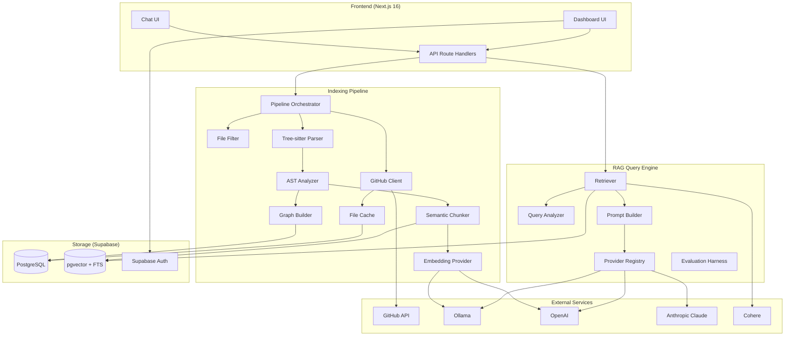

## Data Flow: Full Indexing

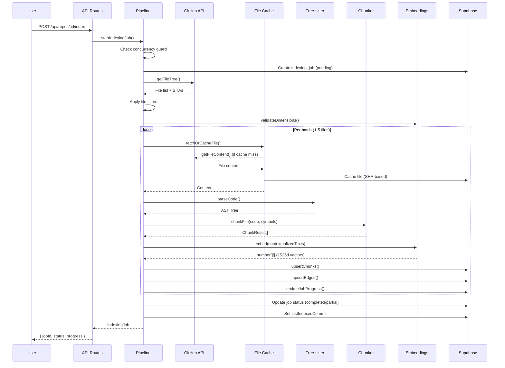

## Data Flow: Incremental Indexing

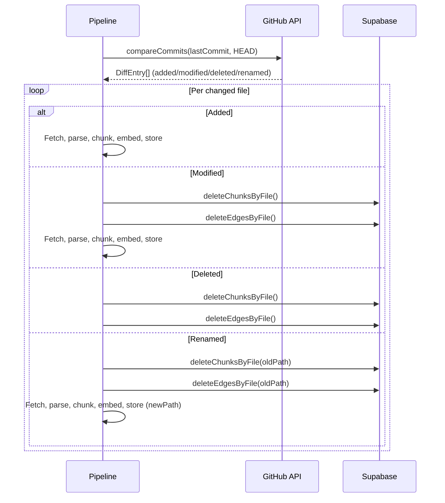

## Entity Relationship Diagram

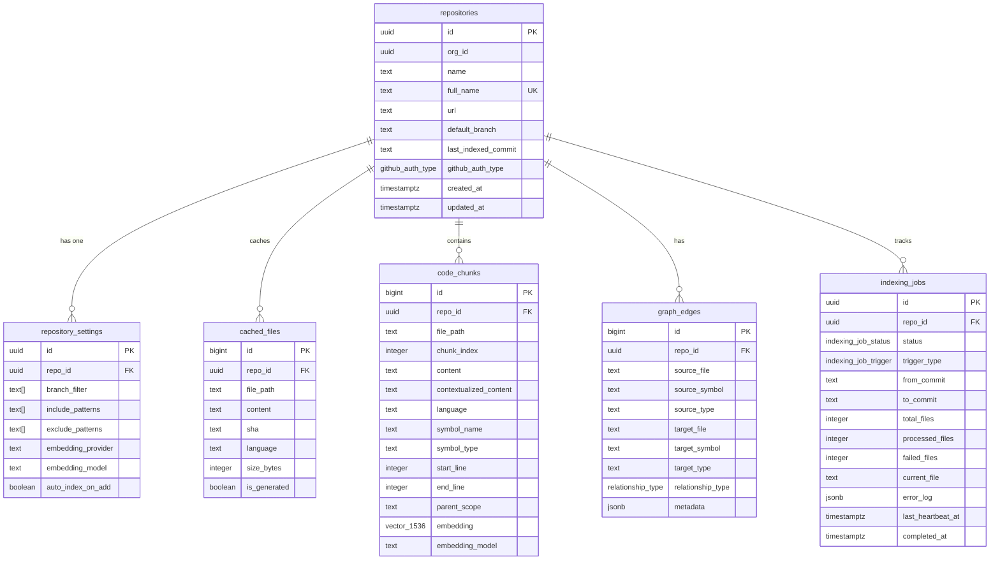

## Module Dependency Graph

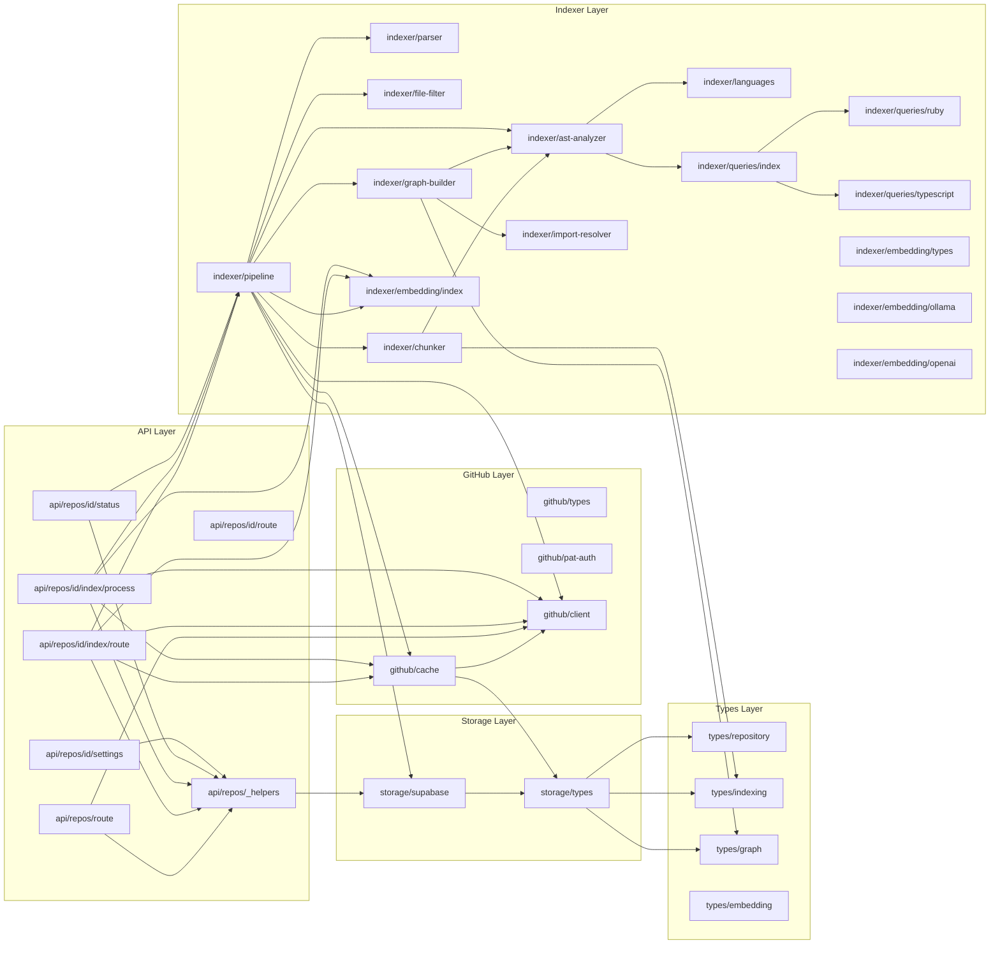

## AST Processing Pipeline

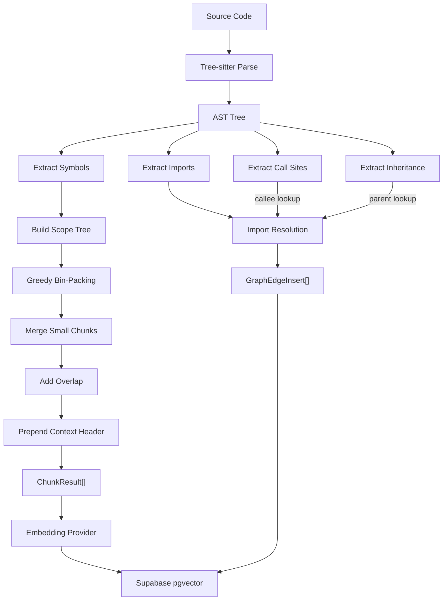

## Self-Chaining Batch Processing

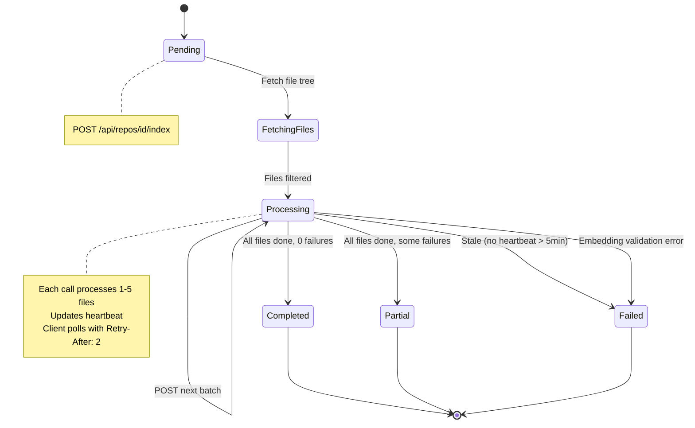

## Knowledge Graph Edge Types

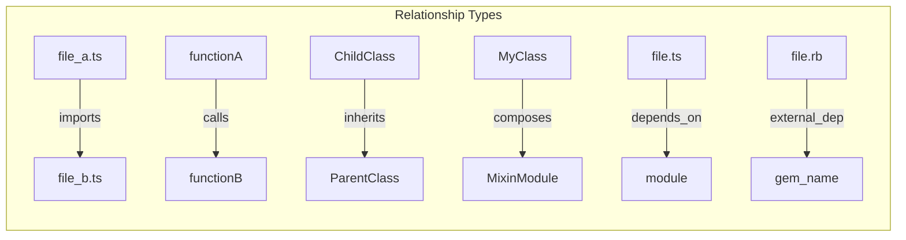

## Security Model

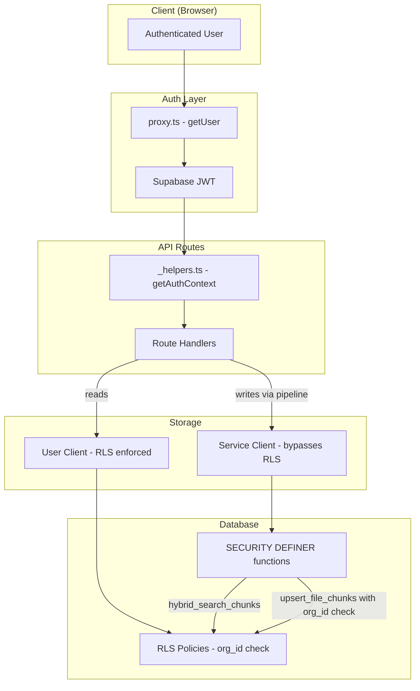

## RAG Query Pipeline

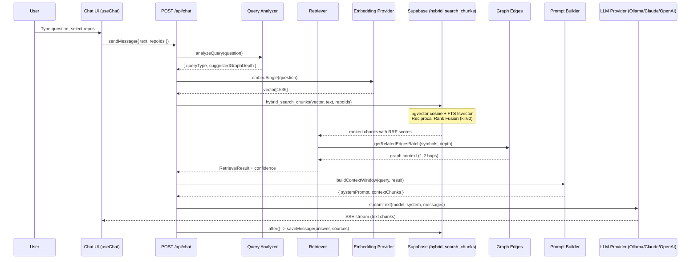

## RAG Module Dependency Graph

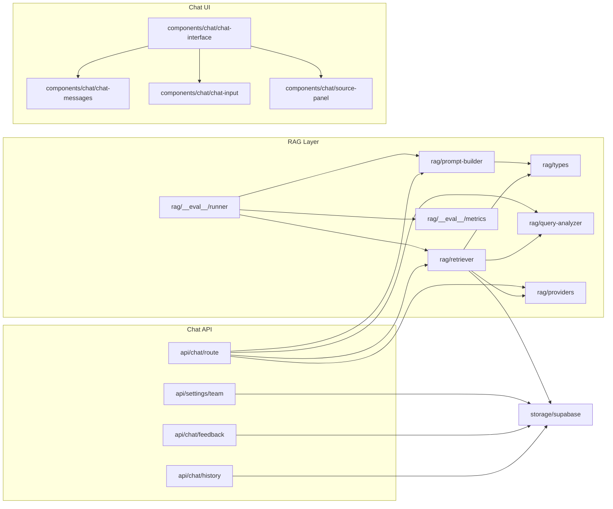

## New Database Tables (Split 02)

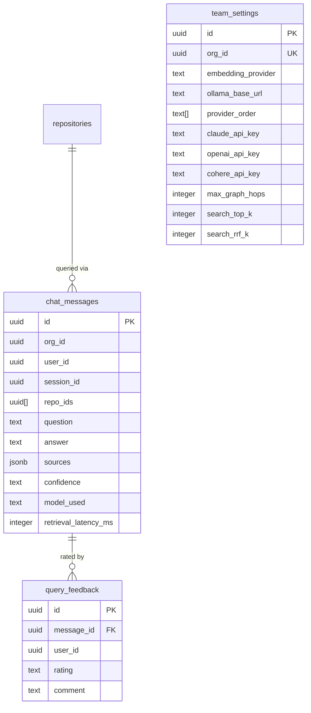
